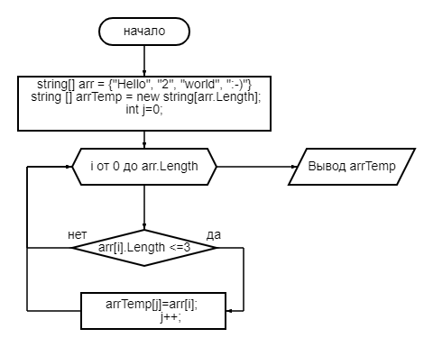

# GB_itog_razrabotchik

## Задача: 
<li><b>Написать программу</b>:</li>
<ol>
  которая из имеющегося массива строк формирует новый массив из строк, длина которых меньше, либо равна 3 символам. Первоначальный массив можно ввести с клавиатуры, либо задать на старте выполнения алгоритма. При решении не рекомендуется пользоваться коллекциями, лучше обойтись исключительно массивами.
</ol>

Примеры значения массива :

<li>
[“Hello”, “2”, “world”, “:-)”]

</li>

>В строке 15 задаем значения нашего массива: 
>>string[] arr = {"Hello", "2", "world", ":-)"};
<li>
[“1234”, “1567”, “-2”, “computer science”]

>попродуй ввсети самостоятельно

</li>
<li>
[“Russia”, “Denmark”, “Kazan”]
</li>

>попродуй ввсети самостоятельно

В строке 17 указываем что хотим вывести на печать результат функции "Foo" c помощью метода "Join" где разделителем будет ",".
    <ul>System.Console.WriteLine(String.Join(",", Foo(arr)));</ul>

Для скачивания проекта перейди по [ссыллке](https://github.com/teinrus/GB_itog_razrabotchik.git)